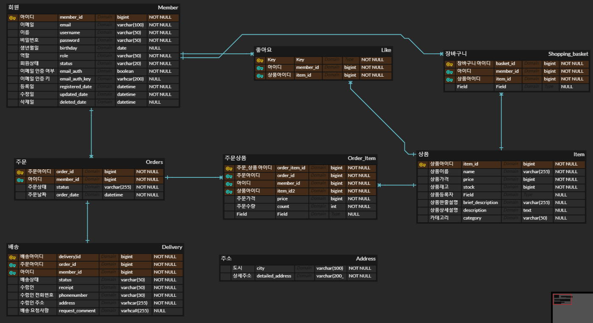

## 개인 프로젝트 소개

---
### 주제 : Onclick Shoppingmall
해당 사이트를 통해 소비자는 원하는 의상을 둘러보고, 구매할 수 있으며, 
판매자는 손쉽게 상품을 업로드하여 판매할 수 있습니다.

### 프로젝트 기획 배경(목적)
- 판매자는 개인 사이트를 만들 필요 없이, 해당 서비스를 통해 쉽게 상품을 판매할 수 있게 하였습니다.
- 소비자는 여러 쇼핑몰을 방문할 필요 없이, 해당 사이트를 통해 한번에 여러 쇼핑몰의 제품을 모아볼 수 있습니다.

### ERD

추후 변경될 수 있음

### 사용 기술 스택
- SpringBoot
- Java
- MySQL / H2
- JPA

### 상세 기능
공통
- 회원가입
    - 이메일과 아이디, 비밀번호를 통해 회원가입할 수 있다.
- 로그인
    - 아이디와 비밀번호로 로그인할 수 있다.
- 로그아웃
- 비밀번호 찾기
    - 가입시 기입한 이메일로 비밀번호를 찾을 수 있다.

고객
- 상품조회
  - 
- 장바구니
- 상품 구매
- 좋아요(찜)
- 구매내역 확인
- 리뷰작성

판매자
- 상품등록
- 상품재고관리
- 매출조회

관리자
- 회원관리(등급)
- 카테고리관리
- 공지사항 관리
- 이벤트
- 게시판 관리

### 프로젝트 구조
미정

  

